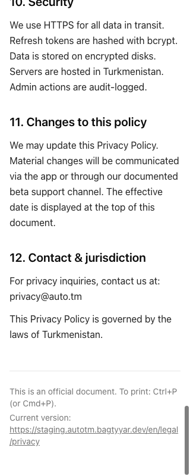
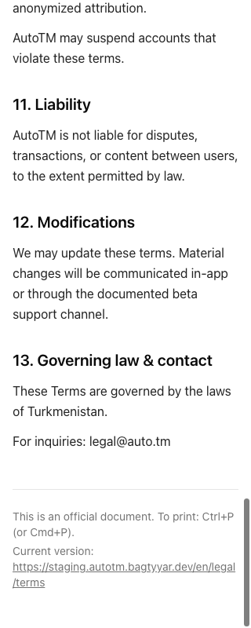

# Narrow legal-page layout evidence

PR #501 review fix, 2026-10-02. Application code tested: `86bfc32b486dd33c345c9117fbe6bcac93c7e0bd`. Later evidence-only commits do not change that code.

The Standards review at `5843ae06` found all six staging legal pages overflowing a 320px viewport. EN Privacy was 367px wide and EN Terms 357px. Allowing long canonical URLs to wrap fixes that regression. The legal page flex child can also shrink, and long words can wrap, so the pre-existing Russian Privacy title no longer widens the page. Full URL text, href and print styling remain intact. Trust already fits, so its source is unchanged.

## Browser measurements

- [Staging runtime origin, all 36 layouts](staging-browser.json)
- [Production runtime origin, all 36 layouts](production-browser.json)

Each result covers Privacy, Terms or Trust in EN/RU/TK at 320, 375, 768 or 1280px. All 72 measurements have document scrollWidth equal to viewport width, and the footer fits its available width. All 48 legal route measurements preserve the exact configured URL in both visible text and href. Both runtime origins were exercised against the same web build, initially built with the staging origin.

## 320px screenshots

| Locale | Staging Privacy | Staging Terms |
| --- | --- | --- |
| EN | [Privacy](staging-en-legal-privacy-320.png) | [Terms](staging-en-legal-terms-320.png) |
| RU | [Privacy](staging-ru-legal-privacy-320.png) | [Terms](staging-ru-legal-terms-320.png) |
| TK | [Privacy](staging-tk-legal-privacy-320.png) | [Terms](staging-tk-legal-terms-320.png) |

Representative production-origin screenshots: [EN Privacy](production-en-legal-privacy-320.png), [EN Terms](production-en-legal-terms-320.png). All six staging screenshots were visually inspected. The 320px footer is visible without clipping or horizontal scrolling.

## Validation and limits

Web Vitest: 85 passed. Web lint: passed, no warnings. Web typecheck: passed. Web production build with staging WEB_BASE_URL: passed. Git diff whitespace check: passed. The fresh worktree first needed the unchanged contracts package built; initial unresolved-contract checks were rerun successfully after that prerequisite.

Browser proof used isolated headless Chrome and a local Next server, with no shared browser profile, Docker, or staging/production deployment changes. This is responsive layout and local runtime evidence, not external DNS/TLS, live hosting or native Android proof. Issue #496 stays open for the human deployment and external-network criteria. Root/mobile evidence at `5843ae06` awaits independent Delta carry-forward; it is not claimed as a new run. Required hosted CI must pass on the final PR head. Preserve the separate #499 removal of Share/Copy link during integration.
