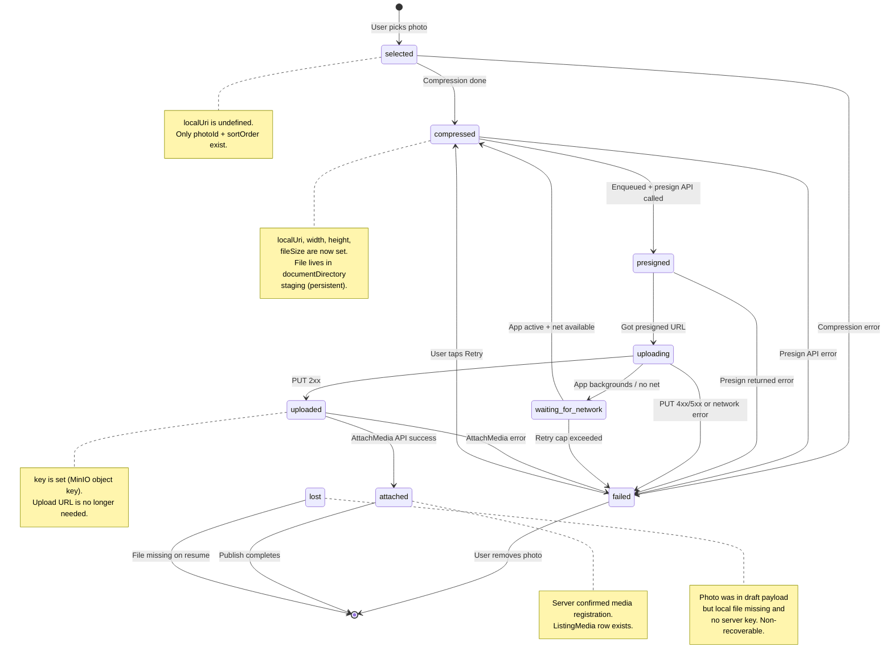
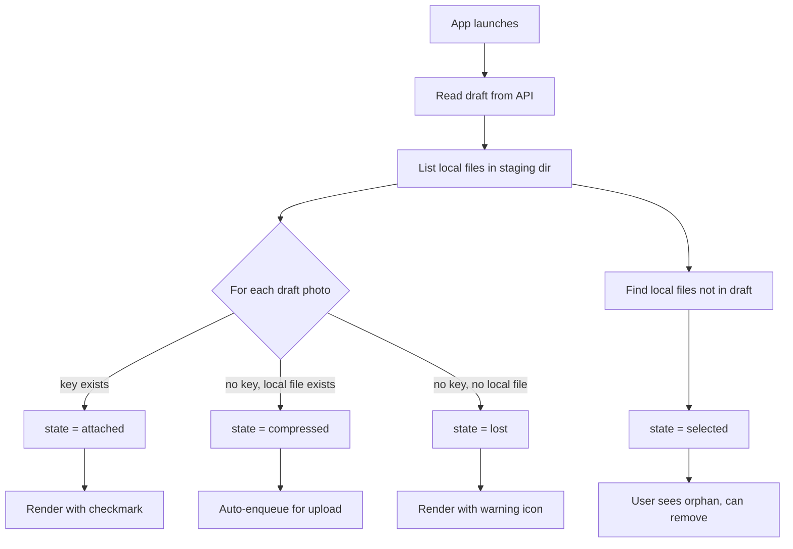
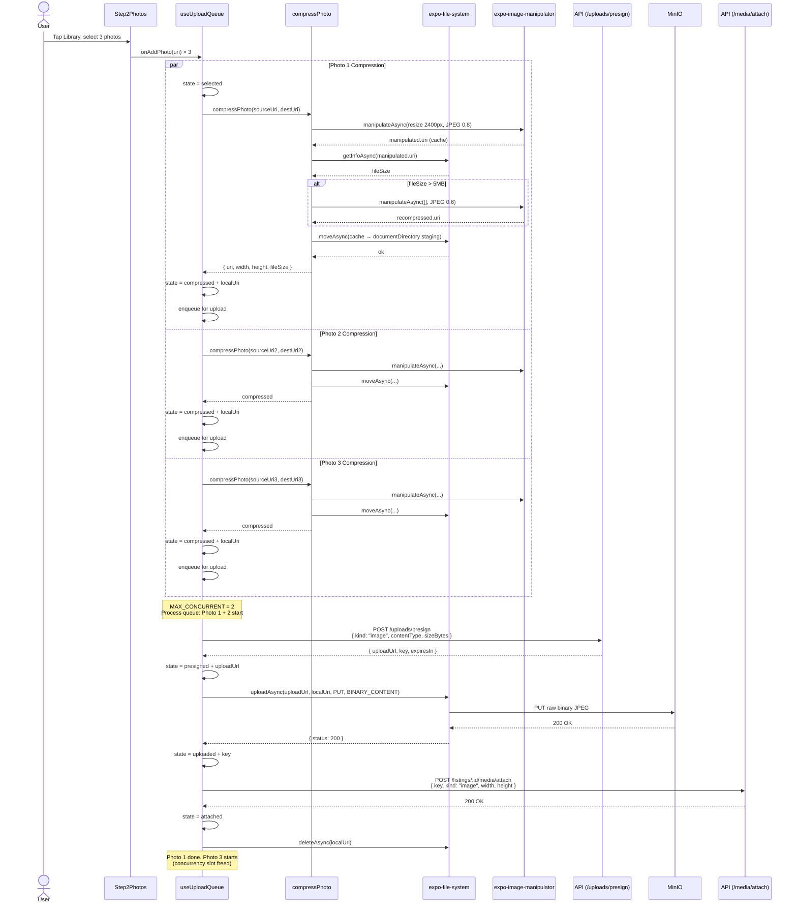
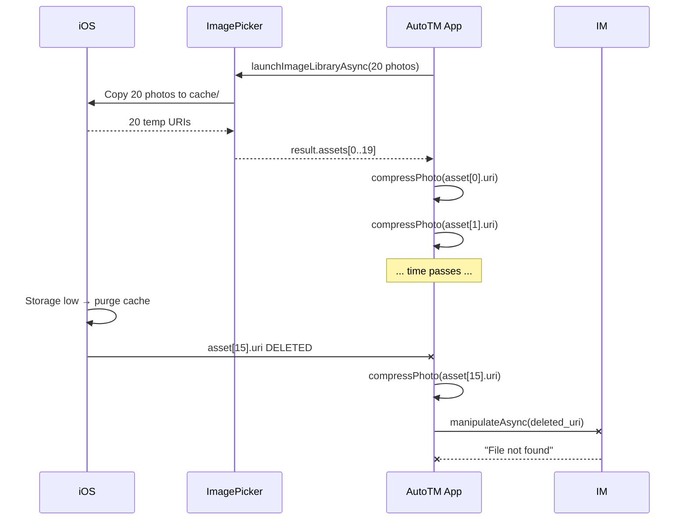
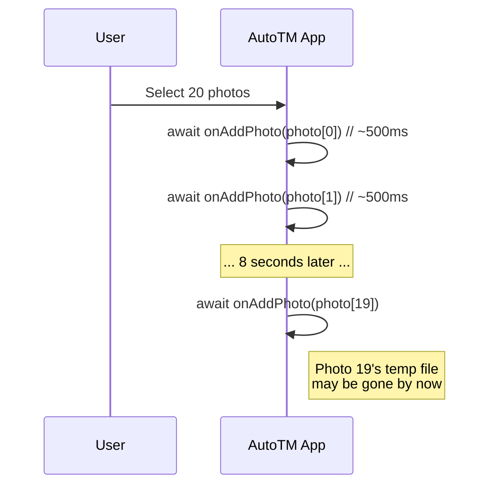
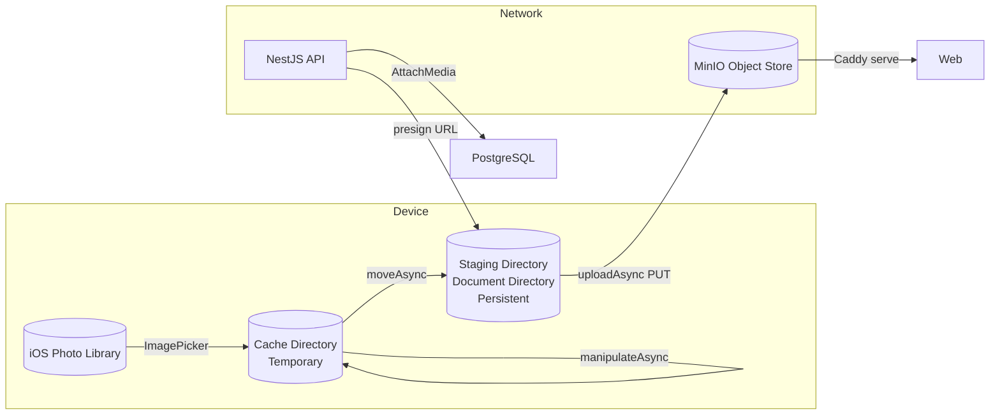
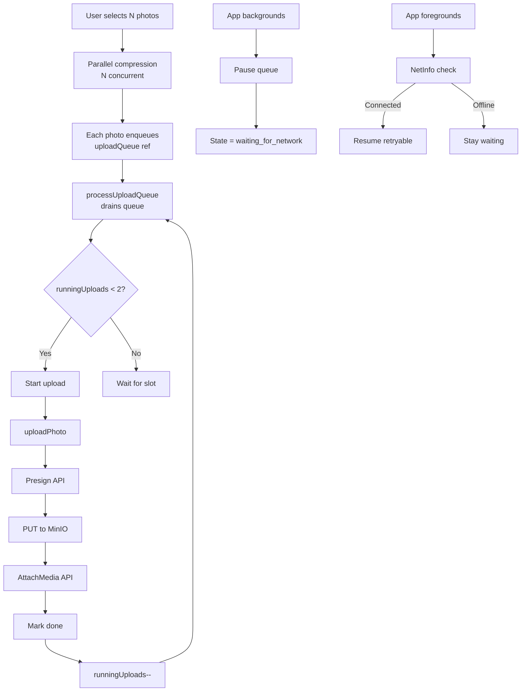

# Flow 61 — Create Listing: Wizard + Upload Pipeline Deep Analysis

> Companion to [`61-create-listing.md`](61-create-listing.md). This document analyses the 7-step mobile wizard's upload pipeline in depth: state machines, race conditions, error paths, and post-implementation fixes.
>
> **Written:** 2026-05-19 · **Context7-validated** against Expo SDK 55 docs
>
> **Related issues:** #93 (original wizard), #110-#115 (post-ship hardening)

---

## 1. Wizard Step Flow (User Journey)

```mermaid
flowchart LR
    A[Tap Sell] --> B{Existing drafts?}
    B -->|Yes| C[Show Continue / New listing]
    B -->|No| D[CreateDraft API]
    C -->|Continue| E[Resume at last step]
    C -->|New listing| D
    D --> S1

    subgraph Wizard[7-Step Wizard]
        direction TB
        S1[❶ VIN<br/><small>Optional, skip allowed</small>]
        S2[❷ Photos<br/><small>1-20, compress+upload in background</small>]
        S3[❸ Brand/Model/Gen/Year<br/><small>Pickers, year required</small>]
        S4[❹ Specs<br/><small>Condition, mileage, color, body...</small>]
        S5[❺ Price<br/><small>Amount + currency + seller terms</small>]
        S6[❻ Location<br/><small>Region → City → area text</small>]
        S7[❼ Description + Contact<br/><small>Required desc, phone, allowCalls/Chat</small>]
    end

    S1 --> S2
    S2 --> S3
    S3 --> S4
    S4 --> S5
    S5 --> S6
    S6 --> S7
    S7 --> F{Publish gate?}
    F -->|Blocked| S7
    F -->|OK| G[PATCH draft → Publish API]
    G --> H[Delete draft row<br/>Delete staging dir]
    H --> I[Listing active in feed]
```



**Key invariant:** Steps 3-7 can be filled while step 2's photos upload in parallel. Publish is blocked until:
- At least 1 photo reaches `attached` state
- No photos in `selected` | `compressed` | `presigned` | `uploading` state
- No photos in `failed` state

---

## 2. Upload Pipeline State Machine

### 2.1 Photo Lifecycle States



### 2.2 State Reconstruction on App Launch



**Why this matters:** No AsyncStorage/MMKV needed. State is derived from two sources of truth:
1. Server's `draft.payload.attachedMediaIds` (persistent)
2. Local filesystem at `${documentDirectory}listing-staging/<draftId>/` (persistent)

---

## 3. Sequence Diagram: Full Photo Upload



---

## 4. Race Condition Analysis

### 4.1 Fixed: setQueue vs processUploadQueue Race

**Problem (fixed in `c5ed428`):**
```typescript
// BEFORE (broken)
setQueue(prev => updatePhotoState(prev, photoId, "compressed", { localUri: ... }));
uploadQueue.current.push(photoId);
processUploadQueue(); // queueRef.current hasn't updated yet!
// uploadPhoto reads queueRef.current → localUri is undefined → "Local file missing"
```

**Fix:**
```typescript
// AFTER (fixed)
queueRef.current = updatePhotoState(queueRef.current, photoId, "compressed", { localUri: ... });
setQueue(queueRef.current); // same object
uploadQueue.current.push(photoId);
processUploadQueue(); // queueRef.current is now consistent
```

### 4.2 Active: iOS Temp File Cleanup Race

**Problem:** Picker returns cache-directory URIs. iOS can delete them.



**Mitigation:** Issue #114 — copy to document directory before compression.

### 4.3 Active: Sequential Processing vs Temp File Lifetime



**Mitigation:** Issue #115 — parallel compression via `Promise.all`.

---

## 5. Error Taxonomy & Handling Matrix

| Error | When | Retryable? | User Message | Auto-Resume? |
|-------|------|-----------|--------------|--------------|
| **Compression failed** | `manipulateAsync` throws | Yes (re-select) | "Compression failed — please retry" | No (user must retry) |
| **Source file missing** | Temp file cleaned up | No | "Original photo deleted — please re-select" | No |
| **Presign API error** | 4xx/5xx from `/uploads/presign` | Yes | "Server error — please retry" | Yes |
| **Rate limited (429)** | ThrottlerGuard hit | Yes (after delay) | "Too many uploads — retry in a moment" | No (skip in resume) |
| **PUT failed** | MinIO returns 4xx/5xx | Yes | "Upload server error — please retry" | Yes |
| **Network failure** | No connectivity during PUT | Yes | "No connection — will retry automatically" | Yes |
| **Local file missing** | Staging file deleted/corrupted | No | "Photo file missing — remove and re-select" | No |
| **AttachMedia failed** | 4xx/5xx from `/media/attach` | Yes | "Server error — please retry" | Yes |

**Current gaps (Issue #112):**
- All errors except 429 show generic "Upload failed"
- No distinction between retryable and non-retryable in UI
- Auto-resume retries everything except rate-limited and retryCount >= 2

---

## 6. Data Flow: File Locations



**File lifecycle:**
- **Cache** (temp): Picker output → manipulator output → moved to staging → deleted
- **Staging** (persistent): Holds compressed JPEGs until upload+attach succeeds → deleted
- **Staging** (orphan): If draft discarded or app killed mid-upload → cleaned on next launch

---

## 7. Concurrency Model



**Current limits:**
- Compression: unlimited (runs immediately per `addPhoto`)
- Upload: max 2 concurrent (`MAX_CONCURRENT`)
- Auto-retry: max 2 attempts per photo (`retryCount < 2`)
- Rate-limited photos: skipped in auto-resume

---

## 8. Post-Issue #93 Fixes Log

Issue #93 (mobile wizard) closed via PR #110. The following fixes were discovered during simulator testing and applied as post-ship hardening:

| Commit | Issue | Root Cause | Fix |
|--------|-------|-----------|-----|
| `b8d3f3c` | JWT 401 on all API calls | `IdentityModule` registered its own `JwtModule` before `ConfigModule.forRoot()` loaded `.env`. Tokens signed with fallback secret `"dev-secret-change-me"`, verified with real secret. | Removed redundant `JwtModule` from `IdentityModule`. Updated 8 e2e tests to import `JwtModule` explicitly. |
| `8542079` | 429 rate-limit on multi-photo upload | `ThrottlerGuard` at 60/min hit by simultaneous presign requests. Plus retry storm from auto-resume. | `@SkipThrottle()` on `/uploads/presign`. Mobile concurrency limit `MAX_CONCURRENT = 2`. Retry cap at 2. Rate-limited photos skipped in auto-resume. |
| `c5ed428` | "Local file missing" + "PUT failed" | Race: `setQueue()` async, `processUploadQueue()` ran before React state propagated. Plus `uploadAsync` defaulted to MULTIPART. | Synchronous `queueRef.current` update before enqueue. `uploadType: BINARY_CONTENT` on PUT. |
| `c1c3747` | Crash: `ImagePicker.MediaType.Images` | `MediaType` is a TS type alias, not runtime object. `ImagePicker.MediaType` = `undefined`. | Changed to string literal array: `mediaTypes: ["images"]` |

---

## 9. Open Hardening Issues

| Issue | Title | Risk Level | Effort |
|-------|-------|-----------|--------|
| #114 | iOS temp file cleanup | **High** — data loss on multi-select | Medium |
| #115 | Sequential processing blocks UI | **Medium** — UX + temp file risk | Low |
| #112 | Error categorization | **Medium** — poor UX, wrong retries | Medium |
| #113 | moveAsync fallback | **Low** — edge case, silent failure | Low |
| #111 | manipulateAsync deprecated | **Low** — tech debt, SDK 56 risk | Medium |

---

## 10. Decision Checklist for Future Changes

Before modifying the upload pipeline, verify:

- [ ] Does the change preserve the "two sources of truth" reconstruction model?
- [ ] Does `queueRef.current` stay in sync with `setQueue()` for all state transitions?
- [ ] Are new error cases categorized as retryable vs non-retryable?
- [ ] Does auto-resume know whether to retry the new error?
- [ ] Are cache-directory files assumed temporary and document-directory files assumed persistent?
- [ ] Does the change work with `MAX_CONCURRENT = 2` without deadlocking the queue?
- [ ] Are picker URIs validated with `getInfoAsync` before native operations?
